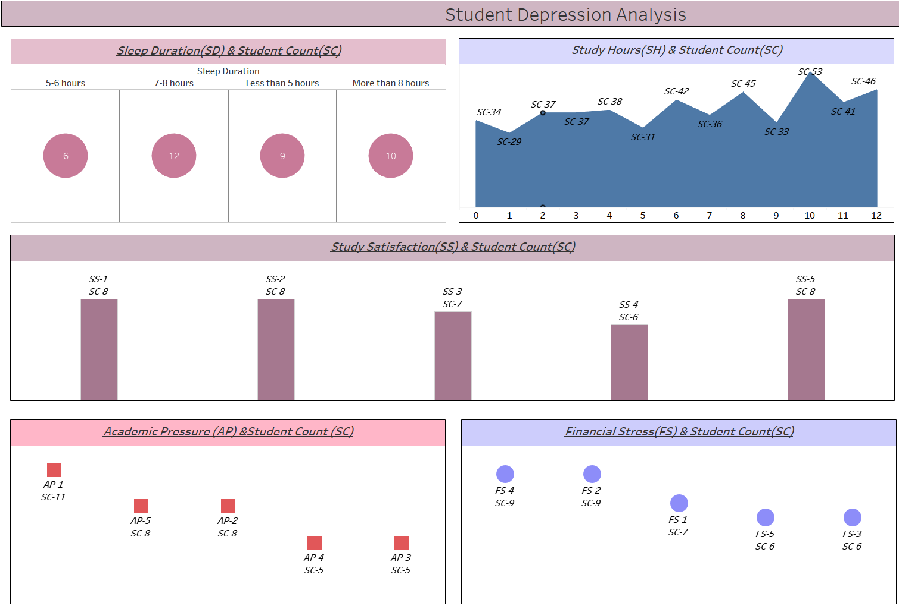

# 📊 Student Depression Analysis — SQL + Tableau Project

This project aims to explore and visualize the relationship between various academic and lifestyle factors and student depression levels. The analysis is based on multiple parameters such as sleep duration, study hours, academic pressure, financial stress, and study satisfaction. The visualizations were created using **Tableau**, and data handling was done using **SQL**.

---

## 📁 Project Structure

### 🔍 Analysis Factors:
1. **Sleep Duration (SD)**  
2. **Study Hours (SH)**
3. **Study Satisfaction (SS)**
4. **Academic Pressure (AP)**
5. **Financial Stress (FS)**

### 📊 Visualizations:
- **Bubble Chart**: Sleep Duration vs. Student Count  
- **Area Chart**: Study Hours vs. Student Count  
- **Bar Chart**: Study Satisfaction vs. Student Count  
- **Square Chart**: Academic Pressure vs. Student Count  
- **Bubble Chart**: Financial Stress vs. Student Count  

---

## 🧠 Key Insights

- Most students fall within the **7-8 hours sleep range** (12 students), followed by those sleeping **more than 8 hours** (10 students).
- **Study Hours** show a gradual rise and fluctuations, peaking at **Hour 11** with **53 students**.
- **Study Satisfaction** is fairly balanced, with most levels reporting **7–8 students**.
- The highest **Academic Pressure** level (AP-1) is experienced by **11 students**.
- **Financial Stress** levels FS-2 and FS-4 are tied, with **9 students each**.

---

## 🛠 Tools Used

| Tool       | Purpose                     |
|------------|-----------------------------|
| **SQL**    | Data extraction and querying|
| **Tableau**| Data visualization and dashboard creation |
| **Excel/CSV** | (Optional) Pre-processing of data |

---

## 📌 How to Use

1. Clone the repository.
2. Import the dataset into your SQL environment.
3. Run the SQL queries to extract insights or export them to CSV.
4. Open Tableau and load the processed data.
5. Recreate or modify the dashboard as per your analysis needs.

---

## 📁 Dashboard Features

- Interactive charts with clear legends and color coding.
- Easy-to-read breakdowns of student distribution across categories.
- Visual emphasis on critical indicators like study hours and pressure levels.

---

## 📬 Feedback

Have suggestions or want to collaborate? Feel free to open an issue or reach out!
